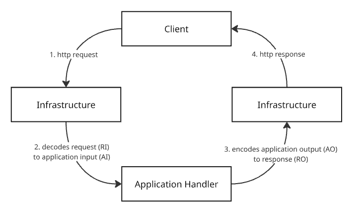

# 001 - Generic API handlers

## Status
Proposed

## Context
Every REST endpoint needs the same plumbing: decode the HTTP request, call an application handler, encode the result, and turn errors into the right HTTP response. Writing this by hand for each entrypoint invites copy-paste drift between endpoints and mixes transport concerns into application logic. We needed a way to reuse this boilerplate while keeping application handlers free of HTTP details.

## Decision
We use generic handler factories in `infra/rest/handler.go` to wire REST input/output around application handlers. `NewHandler[DO, AI, RO]` covers standard single-resource endpoints, and a second factory covers list endpoints that support filtering, sorting and pagination. Every application handler must follow the same signature: `func(context.Context, AI) (DO, error)`.

## Consequences
Endpoints share consistent request decoding, error handling and response encoding, and application handlers stay decoupled from `net/http`, making them easier to test in isolation. The trade-off is the indirection and type-parameter noise generics add, which raises the learning curve for newcomers and can produce verbose compiler errors when types don't line up. Any handler that can't fit the fixed `(context, AI) -> (DO, error)` shape needs a separate, non-generic path. It also means more symbols to maintain, since REST input/output (RI/RO) and application input/output (AI/DO) are separate structs instead of one shared type — but this is what decouples the REST representation from the application representation, so each can evolve independently.
