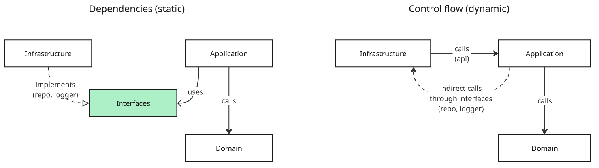

# Architecture

The project is organized in three layers: **domain**, **application**, and **infra**.
Each layer has a single responsibility, and dependencies only point inward, from
infra towards application, and from application towards domain.

```
infra → application → domain
```

## Dependencies vs. control flow

It's important to separate two things that are easy to conflate: who a layer
*depends on* (static, compile-time) and who *calls* whom at runtime (dynamic,
control flow).



- **Dependencies (static)**: infra depends on the application layer, and the
  application layer depends on the domain layer. This is what package imports
  show, and it's what the dependency rule above enforces. Notably, infra
  doesn't depend on application *directly* for everything, application
  declares interfaces (e.g. `ProductsRepository`) and infra implements them.
  So infra also depends on those interfaces, even though at runtime it's the
  application layer that calls infra through them (see below). This is the
  Dependency Inversion Principle: the arrow of implementation ("implements")
  points from infra to the interface, but the interface itself lives next to
  the code that uses it, the application layer.
- **Control flow (dynamic)**: at runtime, infra calls into the application
  layer (e.g. a REST handler calling `App.ListProducts`), and the application
  layer calls into the domain layer. But the application layer also triggers
  calls back into infra, indirectly, through the repository and logger
  interfaces it declared and infra implemented (e.g. `productsRepo.GetProducts`
  ends up executing a SQL query in `infra/models`). So control flow can go
  from application into infra, even though infra is the one that statically
  depends on application.

In short: **infra depends on application, but application drives infra**
through the interfaces it owns. This is what keeps the domain and application
layers free of framework/database details, while still letting them use those
capabilities through abstractions they control.

## Domain (`domain/`)

Contains the core business entities, value objects, and rules of the application
(e.g. `catalog.Product`, `catalog.Category`, `price.Price`).

- Holds pure business logic only: no I/O, no framework code, no knowledge of how
  it's exposed (HTTP) or persisted (database).
- Has **no dependency on the application or infra layers**. It only depends on
  the standard library and other domain packages.
- This makes it the most stable layer: it can be reused, tested in isolation,
  and changed without touching how it's delivered or stored.

## Application (`app/`)

Acts as the entry point from the outside world and orchestrates domain behavior.

- Exposes use cases (e.g. `App.ListProducts`) that infra calls to fulfill a
  request.
- Coordinates domain objects and repositories to perform a task, but doesn't
  contain business rules itself, those live in the domain layer.
- Declares the interfaces it needs from the outside (e.g. `ProductsRepository`,
  `CategoriesRepository` in `app/catalog/interface.go`), following the
  dependency inversion principle: infra provides the implementation, the
  application layer only depends on the abstraction.
- Depends on the domain layer, but not on infra.

## Infra (`infra/`)

Contains the concrete implementations that connect the application to the
outside world.

- `infra/api` and `infra/rest`: HTTP handlers, routing and middlewares that
  translate REST requests into calls to the application layer.
- `infra/models`: database repository implementations (e.g.
  `ProductsRepository`) that satisfy the interfaces declared in the
  application layer.
- `infra/monitor`: logging and observability implementations.
- Depends on both the application and domain layers, wiring everything
  together (see `cmd/server/main.go`).

## Dependency rule

```
domain      <- depends on nothing else in this project
application <- depends on domain
infra       <- depends on application and domain
```

This keeps business rules isolated and testable, and allows swapping infra
details (e.g. the database, the HTTP framework) without touching the domain
or application layers.
